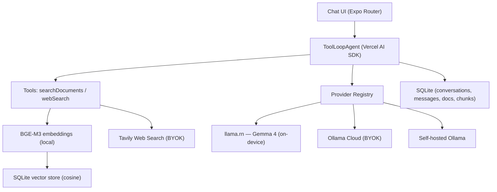

<div align="center">


# 🪄 Oh Matilda

**An agentic, offline-first AI assistant that runs on your phone.**

RAG over your documents · Self-correcting agent loop · Local LLM via `llama.cpp` · Optional cloud providers (BYOK)

[](./LICENSE)
[](#)
[](#)
[](#)

<!-- 📸 Add chat / files / settings screenshots here -->
<!--  -->

</div>

---

## What is this?

**Oh Matilda** is an Android app that runs a real **agentic RAG assistant directly on your device** — no mandatory server, no mandatory account, no data leaving your phone unless *you* choose to.

Drop in your PDFs and Word documents, ask questions, and Matilda will retrieve the relevant chunks, grade their relevance, and self-correct if the answer isn't well supported — all powered by a quantized LLM running locally via `llama.cpp`.

If you want more power (or a smaller battery hit), you can switch to a cloud model — but **you bring your own API key**. Oh Matilda never bundles or proxies your credentials.

---

## ✨ Features

- **Local-first LLM** — Gemma 4 (Q2/Q4 GGUF) running on-device via `llama.rn`
- **Agentic RAG** — semantic search over your own documents (PDF, DOCX) using local BGE-M3 embeddings
- **Self-correction loop** — low relevance scores trigger an automatic query rewrite before answering
- **Web search tool** — optional, via Tavily (bring your own API key)
- **Multi-provider** — switch between local model, Ollama Cloud, or your own self-hosted Ollama instance
- **Persistent memory** — SQLite-backed conversation history with automatic context compaction
- **Streaming chat UI** — markdown rendering, regenerate / edit / copy
- **Multimodal input** — attach images to your messages (vision-capable local model)
- **Dark/light themes**, fully offline-capable from first launch (after model download)

---

## 🏗️ Architecture



**Request flow, simplified:**

1. User sends a message
2. The agent decides whether to search local documents and/or the web
3. Retrieved chunks are graded for relevance — if too weak, the query is automatically rewritten and retried (self-correction)
4. The response streams back to the UI, and the conversation is persisted locally
5. Long conversations are automatically summarized to stay within the model's context window

---

## 🧠 Tech Stack

| Layer | Technology |
|---|---|
| Framework | Expo SDK 54 (React Native 0.81, New Architecture), Expo Router |
| Language | TypeScript |
| Agent / AI SDK | Vercel AI SDK (`ai` v6), `ToolLoopAgent` |
| Local LLM runtime | `llama.rn` + `@react-native-ai/llama` |
| Cloud LLM | Ollama (cloud or self-hosted), OpenAI-compatible |
| Embeddings | BGE-M3 (GGUF, local) |
| Vector search | SQLite + cosine similarity |
| Document parsing | `expo-pdf-text-extract` (PDF), `mammoth` (DOCX) |
| Web search | Tavily API |
| Styling | NativeWind (Tailwind CSS) |
| Storage | `expo-sqlite`, `expo-file-system` |

---

## 📦 Models

| Provider | Model | Notes |
|---|---|---|
| **Local** (`llama.rn`) | Gemma 4 (Q2_K_XL / Q4_K_XL GGUF) | Fully offline, downloaded on first launch |
| **Embeddings** | BGE-M3 (GGUF) | Local, used for RAG |
| **Ollama Cloud** | e.g. `minimax-m3:cloud` | Bring your own Ollama API key |
| **Self-hosted Ollama** | Any model you run | Point Oh Matilda at your own server |

> The models above are the **current defaults**. Support for selecting other local/cloud models is planned for future updates.

> Local models are quantized to run on mid-range Android devices (4–6 GB RAM). Larger/cloud models can be used for heavier agentic tasks.

---

## 🚀 Getting Started

### Prerequisites

- Node.js 18+
- An Android device (or emulator) — Oh Matilda currently targets `arm64-v8a`
- [EAS CLI](https://docs.expo.dev/eas/) for building (`npm install -g eas-cli`)

> ⚠️ This project uses native modules (`llama.rn`, PDF extraction, etc.) and **requires a development build** — it will not run in Expo Go.

### Setup

```bash
git clone https://github.com/Tahsine/oh-matilda.git
cd oh-matilda
npm install --legacy-peer-deps
```

### Run in development

```bash
npx expo start
```

### Build a development/APK build

```bash
eas build --platform android --profile development
```

---

## 🔑 Configuration (Bring Your Own Key)

Oh Matilda is **local-first by default** — no configuration is required to start chatting with the on-device model.

Optional features require your own API keys, entered directly in **Settings**:

| Feature | Provider | Where to get a key |
|---|---|---|
| Cloud LLM | Ollama Cloud | [ollama.com](https://ollama.com) |
| Web search | Tavily | [tavily.com](https://tavily.com) |

Keys are stored locally on your device (SQLite settings table) and are **never sent to any server controlled by this project**.

### Local model settings

The local model's **context window** is configurable in **Settings** (not fixed). A warning is shown when increasing it — larger context windows use more RAM and battery.

---

## 📲 Download

The APK is published under [Releases](../../releases) — no Play Store listing yet.

**Manual install:** download the latest `.apk` from Releases and sideload it (enable "Install from unknown sources").

**Auto-updates via [Obtainium](https://github.com/ImranR98/Obtainium):**
1. Install Obtainium
2. Add app → paste this repo's URL: `https://github.com/Tahsine/oh-matilda`
3. Obtainium will track new GitHub Releases and prompt you to update

> 💡 To make this work smoothly, each release must include the `.apk` as a release asset with a proper version tag (e.g. `v0.1.0`).

---

## 🗺️ Roadmap

- [x] Local agentic RAG (PDF/DOCX) with self-correction
- [x] Multi-provider (local / Ollama Cloud / self-hosted)
- [x] Web search tool (Tavily, BYOK)
- [x] Conversation memory with auto-compaction
- [x] Multimodal image input
- [ ] Vision-based analysis of scanned/image documents
- [ ] Hierarchical RAG (summaries + detailed chunks)
- [ ] Additional local tools (notes, calendar)
- [ ] iOS support
- [ ] Optional encrypted cloud sync (separate opt-in service)

---

## ⚠️ Known Limitations

- Android only (`arm64-v8a`), iOS not yet supported
- Default local context window is ~4096 tokens, adjustable in Settings (higher values increase RAM/battery usage)
- Performance depends heavily on device RAM (4 GB minimum recommended)
- PDF/DOCX parsing only — scanned/image-based documents are not OCR'd yet

---

## 🤝 Contributing

Contributions, issues, and feature requests are welcome. This project is built fully in the open — feel free to fork, experiment, and submit PRs.

---

## 📄 License

MIT — see [LICENSE](./LICENSE).

---

## 🙋 About

Built by [Borrelle Dev](https://github.com/Tahsine) — AI engineer based in Benin, exploring offline-first agentic AI on resource-constrained hardware.

</div>