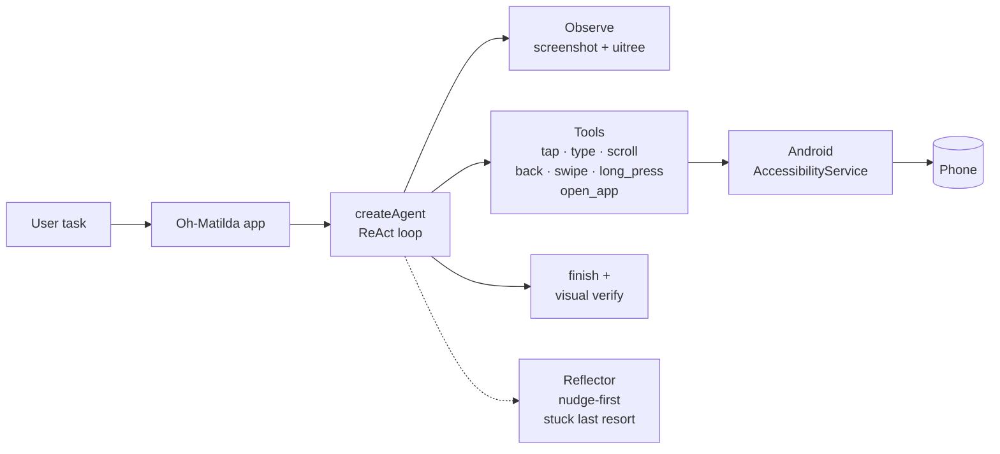

<p align="center">
  
</p>

<h1 align="center">Oh-Matilda — on-device Android AI agent</h1>

<p align="center">
  
  
  <a href="https://youtu.be/1frk7yUQ3sg"></a>
  
</p>

<p align="center">Mobile-only Android app (Tauri v2): chat with an LLM + an agent that <b>operates your real phone</b> — opens apps, taps, types, scrolls — to accomplish tasks. No ADB, no root, no emulator.</p>

## Demo (uncut, real device)

An agent searches "embedding gemma 2" on YouTube, opens the video, likes it (counter verified), posts a comment — one continuous run, only dead time cut:

**https://youtu.be/1frk7yUQ3sg**

Eval report (device battery, honest failures included): [`docs/agent-eval.md`](docs/agent-eval.md).

## How it works

- **Chat** (fast/thinking): Ollama Cloud (`gemma4:31b`) via Vercel AI SDK, streamed.
- **Agent** (`createAgent`, LangGraph ReAct): observes screenshot + accessibility tree, acts with `tap / open_app / type / scroll / back / swipe / long_press`, concludes with single-call `finish` + visual `verify`. Nudge-first loop reflector, honest `stuck`, user Stop.
- **Native** (Kotlin, `src-tauri/gen/android/...`): `AccessibilityService` (resolve, gestures, denylist), foreground service + watchdog, keyboard-height bridge, safe-area insets.

### Agent loop


```mermaid
flowchart LR
    U[User task] --> A[Oh-Matilda app]
    A --> G[createAgent\nReAct loop]
    G --> O[Observe\nscreenshot + uitree]
    G --> T[Tools\ntap · type · scroll\nback · swipe · long_press\nopen_app]
    T --> N[Android\nAccessibilityService]
    N --> P[(Phone)]
    G --> F[finish +\nvisual verify]
    G -.-> R[Reflector\nnudge-first\nstuck last resort]
```

The model (Ollama Cloud `gemma4:31b`) reasons per turn; tools resolve element ids to gestures natively. Guards (80-step budget, 10-min deadline, user Stop) bound runaway runs without capping legitimate long ones. Details + device numbers: [`docs/agent-eval.md`](docs/agent-eval.md).

### Why is the debug APK 180 MB?

Short answer: **debug symbols, not the app.** Measured (`arm64-debug`, Oct 2026):

| Content | Size | Share |
|---|---|---|
| `liboh_matilda_lib.so` (Rust, **debug unstripped**) | 173 MB | 96% |
| Kotlin/dex | ~13 MB | 7% |
| Web frontend (all JS/CSS) | 2.7 MB | 1.5% |

Release (`--release`: strip + minify/shrink + per-ABI split) brings it to **14.5 MB APK (10.9 MB AAB)** — measured Oct 2026, arm64, release-signed. Debug stays big: it's the workbench, not the product.

## API key (required)

The app needs an Ollama Cloud API key. Get one here: **https://ollama.com/settings/keys**

Enter it in-app: **Settings → Ollama API key → Save** (stored in the app-private store on your phone, never committed anywhere). The status line shows `Configured ••••XXXX` and the Test button verifies it with a 1-token call.

## Permissions (why)

- **Accessibility service**: the ONLY way to read the screen and perform gestures on-device. It stays on your phone — no screen data ever leaves it except the screenshots sent to the LLM for the current task.
- **Foreground service + notifications**: keeps the agent alive and cancellable (Stop button) during runs.
- **Internet**: LLM calls (`https://ollama.com/api`).

## Dev

```bash
npm install
npm run tauri -- android build --debug --split-per-abi   # per-ABI APKs (arm64 ≈ 180 MB debug)
adb push <apk> /data/local/tmp/ohm.apk && adb shell 'pm install -r /data/local/tmp/ohm.apk'
```

- `OLLAMA_API_KEY` env is optional (compile-time fallback only); the device store wins.
- Docs: [`docs/agent-eval.md`](docs/agent-eval.md) (eval v1→v3).
- Release builds: dedicated keystore (never in git, see `.gitignore`), strip + minify — see roadmap in eval v3 ("Lots actés").

## Roadmap (plans, not promises)

- **v0.1.x** — fixes from real usage (loop recovery, grounding gaps), release hygiene.
- **v0.2** — eval harness (automated battery), agent skills (DeepAgents), durable memory, real sources with citations.
- **Later** — on-device model exploration, multi-app workflows.

## Feedback

- **Bug** → [open an issue](https://github.com/Tahsine/oh-matilda/issues/new/choose) with the template (device, task, run-card verdict — never your API key).
- **Idea / question** → [Discussions](https://github.com/Tahsine/oh-matilda/discussions) (Q&A).
- **Demo reactions** → comments under the [video](https://youtu.be/1frk7yUQ3sg).

## License

MIT — see [LICENSE](LICENSE).
